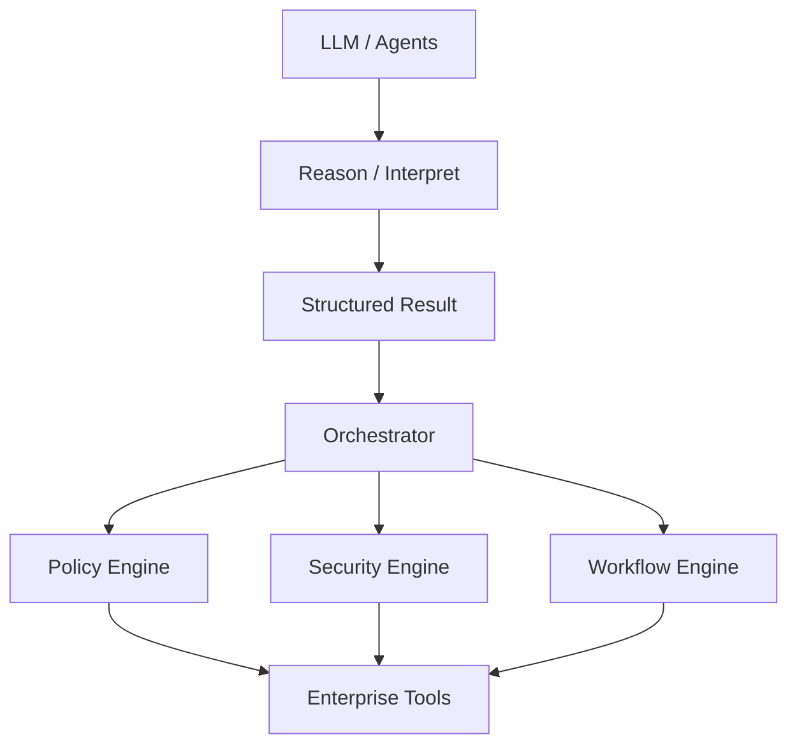
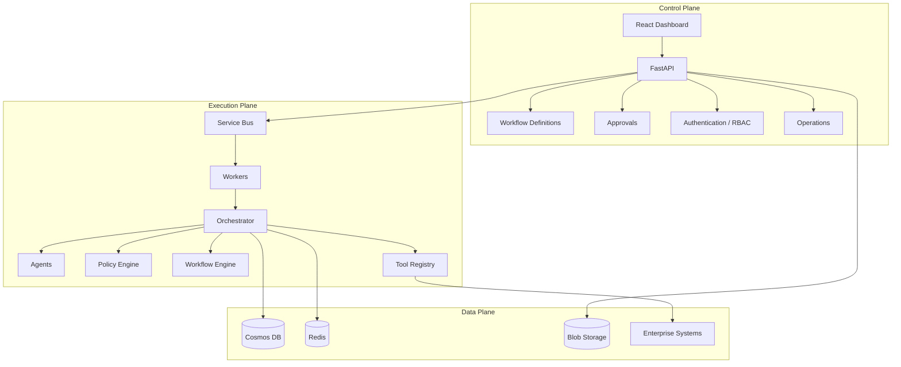
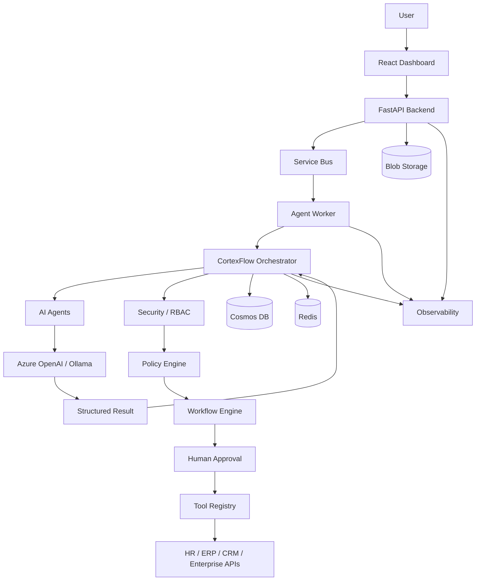
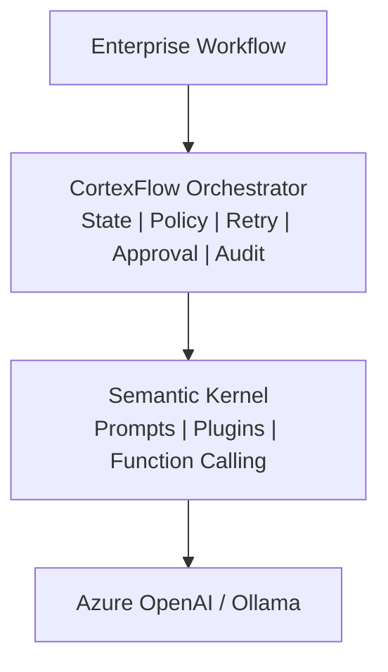
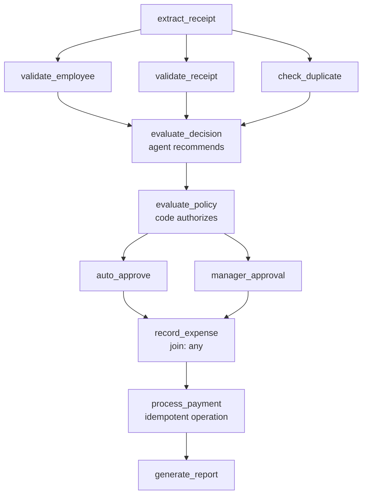
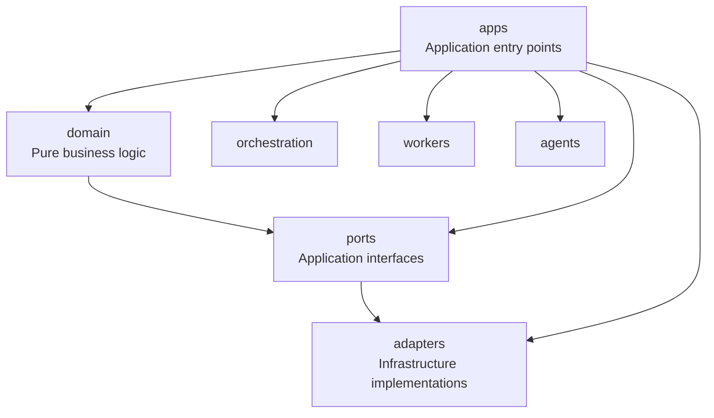

# CortexFlow

Context-aware multi-agent enterprise automation platform.

CortexFlow runs long-lived HR, Finance, and Marketing workflows in which AI agents interpret business context while a deterministic distributed system handles authorization, execution, state, recovery, and auditability.

> A probabilistic component can sit inside a reliable enterprise process when reliability is supplied by the system around the model rather than assumed of the model.

## Design Principles

The core boundary in CortexFlow is simple:



Agents recommend. The policy engine authorizes. The orchestrator executes.

No LLM output reaches an enterprise system without passing through deterministic code that can validate, authorize, reject, retry, or defer the operation.

### Where decisions live

| Concern | Implementation | Not delegated to |
|---|---|---|
| Thresholds and limits | YAML policy rulesets | A prompt |
| Duplicate detection | `finance.find_duplicate_expense` | Model judgment |
| Workflow execution order | `dag.build_plan` | Agent decisions |
| Agent tool access | `ToolRegistry.tools_for` | Whatever the model requests |
| Agent runtime | Semantic Kernel | Workflow engine |
| Durable application state | Cosmos DB | Redis or process memory |

## Architecture

CortexFlow is organized into three operational planes.



### Runtime flow



The system deliberately separates AI reasoning from enterprise execution. Agents interpret requests and return structured results; the orchestrator and control layers determine what is allowed to happen.

## Key Capabilities

- Long-running enterprise workflows
- HR, Finance, and Marketing workflow support
- Deterministic policy enforcement
- Human approval gates
- Durable workflow state
- Retry and recovery handling
- Idempotent enterprise actions
- Dead-letter handling
- Optimistic concurrency
- Agent tool authorization
- Multi-tenant workflow state
- Audit trails
- Semantic Kernel agent runtime
- Local/offline development profile
- Azure deployment profile
- Workflow builder for browser-based workflow composition
- Chaos and reliability testing

## Run Locally

CortexFlow can run end to end without an Azure account or API key.

The local profile replaces:

- Cosmos DB with an in-memory store
- Azure Service Bus with an in-process broker
- Azure OpenAI with a deterministic stub

The local broker still models delivery counts, lock timeouts, and dead-lettering. This allows failure and recovery behavior to be tested without requiring Azure infrastructure.

### Prerequisites

```bash
python -m venv .venv
source .venv/bin/activate

pip install -e ".[dev]"
```

### Start the platform

```bash
./run.sh
```

The dashboard is available at:

```text
http://localhost:5173
```

Stop the platform with:

```bash
./stop.sh
```

### Run the demos

```bash
make demo
make kernel-demo
```

`make demo` runs a complete expense reimbursement workflow.

`make kernel-demo` runs the Semantic Kernel runtime with agent tool calling.

### Run the API

```bash
make api
```

API documentation:

```text
http://localhost:8000/docs
```

### Run everything in one process

```bash
python -m cortexflow.apps.allinone
```

### Run services separately

```bash
cortexflow-api
cortexflow-orchestrator
cortexflow-agent-worker
```

## Azure Configuration

The application is configured through environment variables rather than hard-coded infrastructure dependencies.

```bash
export CORTEXFLOW_PROFILE=azure

export CORTEXFLOW_COSMOS_ENDPOINT=https://<account>.documents.azure.com:443/
export CORTEXFLOW_SERVICEBUS_NAMESPACE=<namespace>.servicebus.windows.net
export CORTEXFLOW_OPENAI_ENDPOINT=https://<resource>.openai.azure.com/

export CORTEXFLOW_AUTH_MODE=entra
```

The same application architecture can therefore run locally or against Azure-backed services without changing workflow code.

## Build a Workflow

The browser-based workflow builder lets users compose business workflows using domain-level steps such as:

```text
Extract
  -> Validate
  -> AI Decision
  -> Policy Gate
  -> Approval
  -> Action
```

A typical workflow can look like:

```text
Upload employees.xlsx
        |
     Analyse
        |
     Extract
        |
     Decide
        |
   Policy Gate
        |
     Approve
        |
     Report
```

The builder compiles these business-level steps into an ordinary CortexFlow workflow definition. The resulting workflow uses the same orchestration engine, retry behavior, approval mechanism, and audit trail as workflows defined directly in code.

Deterministic operations such as counting rows, detecting blanks, and identifying duplicates remain in application code. The model is used where interpretation and judgment are required.

See [the workflow builder guide](docs/workflows/builder.md).

## Agent Runtimes

CortexFlow supports two agent runtime modes.



Semantic Kernel is the agent runtime, not the workflow engine.

### Native runtime

The default runtime performs a structured completion:

```text
native
```

It is suitable when the agent receives the required context and needs to return a structured judgment.

### Semantic Kernel runtime

The Semantic Kernel runtime supports:

- `ChatHistory`
- Function calling
- Plugin-based tool access
- Structured output
- Context gathering

Enable it with:

```bash
export CORTEXFLOW_AGENT_RUNTIME=semantic_kernel
export CORTEXFLOW_LLM_BACKEND=ollama
```

The backend can also be configured for Azure OpenAI:

```bash
export CORTEXFLOW_LLM_BACKEND=azure_openai
```

Kernel plugins are generated from the CortexFlow tool registry. This means an agent can use a convenient function-calling interface without bypassing authorization, validation, idempotency, or audit controls.

The agent gains an interface to existing capabilities, not additional authority.

### Runtime constraints

There are two implementation details worth understanding:

1. Structured output and tool calling cannot reliably be combined in a single turn for the supported setup. CortexFlow therefore uses a two-phase kernel turn.

2. Semantic Kernel function names containing hyphens can break structured tool calling with Ollama models. Azure OpenAI is the supported path for Semantic Kernel tool calling.

See:

- [ADR 0007: Semantic Kernel as Agent Runtime](docs/adr/0007-semantic-kernel-as-agent-runtime.md)
- [ADR 0008: Two-Phase Kernel Turns](docs/adr/0008-two-phase-kernel-turns.md)
- [Semantic Kernel architecture](docs/architecture/semantic-kernel.md)

## Reference Workflow

The reference workflow is:

```text
workflows/finance/expense_reimbursement.yaml
```

Its execution model is:



The independent validation steps can run concurrently.

The decision agent recommends an outcome, while the policy engine determines whether that outcome is authorized.

Adding another department is primarily a matter of adding its workflow definition, ruleset, and enterprise tools. The orchestrator remains unchanged.

## Reliability and Failure Handling

CortexFlow treats failures as part of the workflow model rather than exceptional conditions.

| Failure | System behavior |
|---|---|
| Worker crashes during a step | The lease expires and the sweeper reclaims the step |
| Duplicate queue message | Deduplication prevents duplicate processing |
| Stale workflow result | Results from an obsolete `run_id` are discarded |
| Concurrent orchestrators | Optimistic concurrency detects the conflict |
| Azure OpenAI outage | Transient failure is backed off and parked for recovery |
| Payment API timeout | The same idempotency key is reused |
| Retries exhausted | The workflow is moved to a dead-letter state |
| Human approval expires | The workflow follows the configured approval policy |
| Browser is closed | The workflow continues independently |

The browser is a control-plane interface. It is not responsible for workflow execution.

## Testing

Run the complete test suite:

```bash
make test
```

Run the reliability and chaos suite:

```bash
make test-chaos
```

The chaos suite validates failure scenarios such as worker crashes, duplicate delivery, concurrent execution, service outages, retry behavior, and recovery.

The project verification baseline documented in the repository is:

| Check | Command | Expected state |
|---|---|---|
| Tests | `make test` | 244 passing |
| Lint | `make lint` | Clean |
| Type checking | `make typecheck` | Clean |
| Dashboard | `cd dashboard && npm run typecheck && npm run build` | Clean |
| End-to-end demo | `make demo` | Complete workflow execution |

## Project Structure

```text
src/cortexflow/
|
├── domain/          Pure models, DAG resolution, state machines
├── ports/           Application interfaces
├── adapters/        Cosmos, Service Bus, Redis, Blob, LLM, memory
├── agents/          Agent contracts, prompts, and agents
│   └── kernel/      Semantic Kernel runtime
├── tools/           Tool registry, authorization, idempotency, enterprise tools
├── policy/          Deterministic policy engine and YAML rulesets
├── orchestration/   Engine, dispatcher, sweeper, services
├── workers/         Step executor and worker loop
├── security/        Entra ID authentication and RBAC
├── observability/   Tracing, metrics, and redaction
└── apps/            API, orchestrator, workers, integrations, notifications
```

### Dependency direction

The dependency structure is intentionally one-directional:



The `domain` layer has no infrastructure dependencies.

Azure SDK usage is isolated within the adapter layer, which is why the test suite can run offline.

## Data and State

CortexFlow separates durable state from transient state and file storage.

| Component | Responsibility |
|---|---|
| Cosmos DB | Durable workflow state, approvals, audit, idempotency |
| Redis | Low-latency transient state and caching |
| Blob Storage | Documents and uploaded files |
| Service Bus | Durable asynchronous message delivery |
| Enterprise systems | HR, ERP, CRM, and other business operations |

The orchestrator is responsible for coordinating these components while preserving workflow state and execution semantics.

## Documentation

- [Client Guide](docs/client-guide.md) — customer workflow from start to finish
- [Client Usage](docs/client_usage.md) — fields, roles, permissions, and result handling
- [Complete Project Explanation](complete_project_explanation.md) — detailed project explanation
- [Runbook](RUNDOC.md) — setup, running, testing, and troubleshooting
- [Deployment Guide](deploy.md) — Azure deployment and deployment considerations
- [Architecture Overview](docs/architecture/overview.md)
- [Semantic Kernel Runtime](docs/architecture/semantic-kernel.md)
- [Reliability Model](docs/architecture/reliability.md)
- [Security and Multi-Tenancy](docs/architecture/security.md)
- [Architecture Decision Records](docs/adr/)
- [Expense Reimbursement Workflow](docs/workflows/expense_reimbursement.md)
- [Expense Triage](docs/workflows/expense_triage.md)
- [Workflow Builder](docs/workflows/builder.md)
- [Operations Runbook](docs/architecture/operations.md)

## Project Status

CortexFlow currently demonstrates:

- Multi-agent enterprise workflow execution
- Deterministic policy enforcement around AI decisions
- Human approval workflows
- Durable state and recovery
- Tool authorization and idempotency
- Semantic Kernel agent execution
- Local and Azure execution profiles
- Workflow builder capabilities
- Reliability and chaos testing

The architecture is designed around a clear separation of concerns:

```text
AI reasons.
Policy authorizes.
Orchestration executes.
Storage remembers.
Observability explains.
```
